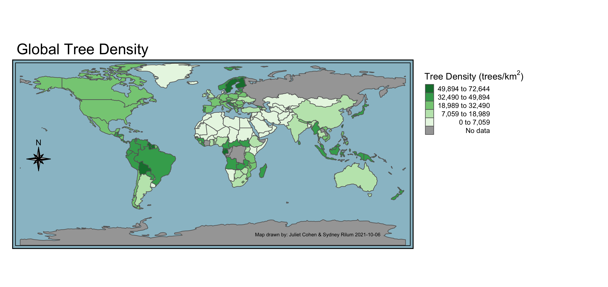

```{r setup, include=FALSE}
knitr::opts_chunk$set(echo = TRUE, message = FALSE, warning = FALSE)
library(RColorBrewer)
library(rgeos)
library(rnaturalearth)
library(rnaturalearthdata)
library(sf)
library(sp)
library(spData)
library(spDataLarge)
library(tidyverse)
library(janitor)
library(tmap)
library(paletteer)
library(readr)
```

```{r}
# Load trees dataset into environment
tree_data <- read_csv("https://raw.githubusercontent.com/owid/owid-datasets/master/datasets/Tree%20density%20(Crowther%20et%20al.%202015)/Tree%20density%20(Crowther%20et%20al.%202015).csv") %>% 
  clean_names()

# Load world dataset from 'spData' package into environment
world_data <- world %>% 
  clean_names()
```

```{r}
# prevent scientific notation in R session
options(scipen = 999)

# check projection of data
# st_crs(world_data) #WGS84, appropriate projection for world map
# st_crs(tree_data) #NA, no geometry, will join data to world data

# view column names in each dataset
# colnames(tree_data)
# colnames(world_data)
```

```{r}
# match country name column titles in each dataset in order to join
colnames(tree_data)[which(names(tree_data) == "entity")] <- "name_long"

# merge the tree data with world data
tree_world_data <- left_join(world_data, tree_data)
```

```{r}
# check the class of data
# class(tree_world_data) # sf, data frame
# class(tree_world_data$tree_density_trees_per_km2) # numeric

# check the range of tree density values, disregarding NA values
# min(tree_world_data$tree_density_trees_per_km2, na.rm = TRUE)
# max(tree_world_data$tree_density_trees_per_km2, na.rm = TRUE)
# range is 0 - 72643 trees per km2
```

```{r, fig.cap = "Tree density data was obtained from 429,775 ground-sourced measurements collected from international forestry databases and combined with biome-level spatial models to predict global tree density at 1 km^2 resolution. Criteria for a tree was specified as a plant with woody stems larger than 10 cm diameter at breast height. Data sources: World map data was obtained from spData package. Tree density data was obtained from: Crowther, T. W., H. B. Glick, K. R. Covey, C. Bettigole, D. S. Maynard, S. M. Thomas, J. R. Smith, et al. 2015. “Mapping Tree Density at a Global Scale.” Nature 525 (7568):201–5.https://doi.org/10.1038/nature14967. Map was rendered in R using tmap."}

# create legend title
legend_title = expression("Tree Density (trees/km"^2*")")

# create map credits text
map_credits = expression("Map drawn by: Juliet Cohen & Sydney Rilum 2021-10-06                  ")

# make a world map of tree density
tree_map = tm_shape(tree_world_data) + 
  tm_borders() + 
  tm_fill(col = "tree_density_trees_per_km2", 
          title = legend_title,
          textNA = "No data",
          colorNA = "gray65",
          style = "jenks",
          labels = c("0 - 7,059", "7,060 - 18,989", "18,990 - 32,490", "32,491 - 49,894", "49,895 - 72,644"),
          palette = "Greens",
          legend.format = list(text.align = "right"),
          legend.reverse = TRUE) +
  tm_layout(main.title = "Global Tree Density", 
            main.title.position = "left",
            main.title.size = 1.5,
            bg.color = "lightblue3") +
  tm_compass(type = "8star",
             size = 1.5,
             position = c("left", "center")) +
  tm_credits(text = map_credits,
             size = 0.5,
             position = c("right", "bottom"),
             align = "right") +
  tm_layout(legend.outside = TRUE,
            legend.outside.position = "right",
            #legend.frame = TRUE,
            #legend.frame.lwd = 0.5,
            #legend.bg.color = "lightblue3"
            )

# save tree map as a png
tmap_save(tree_map, "tree_map.png")

```

<center>



</center>

Tree density data was obtained from 429,775 ground-sourced measurements collected from international forestry databases and combined with biome-level spatial models to predict global tree density at 1 km^2^ resolution. Criteria for a tree was specified as a plant with woody stems larger than 10 cm diameter at breast height. (Data sources: Map was rendered in R using tmap. World map data was obtained from the spData package. Tree density data was obtained from [Crowther, T. W., H. B. Glick, K. R. Covey, C. Bettigole, D. S. Maynard, S. M. Thomas, J. R. Smith, *et al.* 2015. “Mapping Tree Density at a Global Scale.” *Nature* 525 (7568):201–5.](https://doi.org/10.1038/nature14967)).


# Things to do
- fix legend bins, need decimals (ask Niklas)
- determine if keep units trees/km2 after each symbol legend bin (ask Niklas)
- fix formatting, not too much white space, maybe frame the entire map